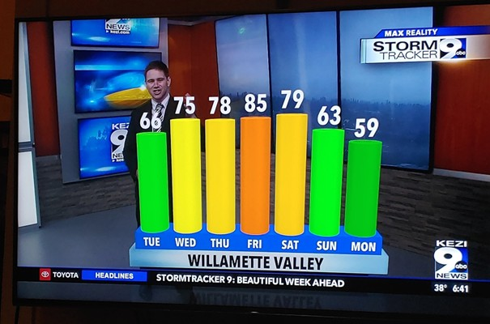
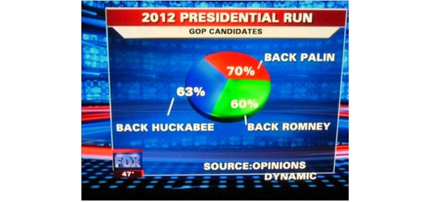
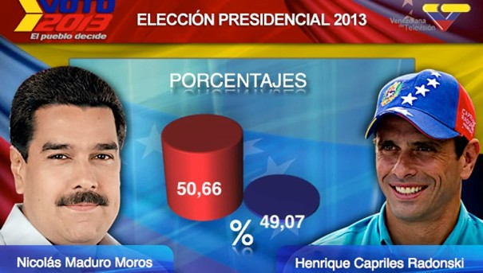

Exemples de 3 visualisations trompeuses
===========

Cette première visualisation est trompeuse en raison de la hauteur des barres. Si on se fit uniquement à la hauteur des barres, on pourrait croire qu'il fait plus chaud le samedi que le vendredi hors c'est l'inverse. Il faut donc fixer la hauteur des barres tout en conservant les couleurs ou changer le type de graphique

Pour cette visualisation, le camembert est divisé en trois parties égales mais en regardant les chiffres associées, on s'aperçoit que le résultat excède les 100%. Pour régler ça, il faudrait utiliser un diagramme en barres en plus d'ajouter une légende indiquant ce que représente ces chiffres (intention de votes, popularité des candidats).

En regardant cette infographie, on pourrait penser que le candidat Randonski est loin derrière Maduro, hors ces deux candidats sont aux coudes à coudes. Il faudrait donc que les deux barres soient similaires.